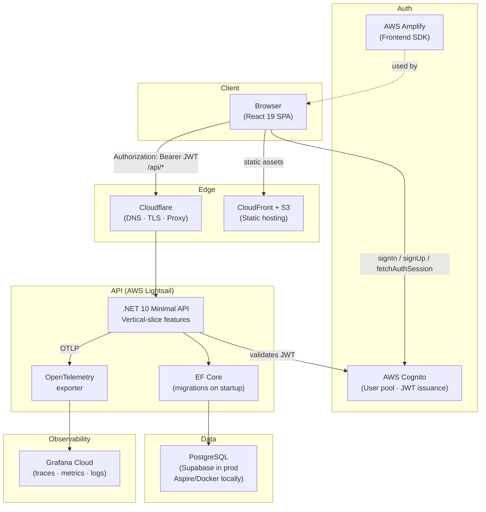

# Quizymode

Quizymode is a full-stack study and quiz application built for people who want to learn from structured question banks. Users can browse items by category, study with flashcards, test themselves in quiz mode, and organise content into personal or shared collections. Content can be created manually, imported in bulk, or generated with AI assistance — and everything is tied to a taxonomy of categories and keywords to keep study sessions focused.

For a full walkthrough with screenshots, see the [User Guide](./docs/user-guide/user-guide.md).

**Tech:** `.NET 10` Minimal API, React 19 SPA, AWS Cognito authentication, PostgreSQL.

Production shape:

- Web app: S3 + CloudFront
- API: AWS Lightsail container
- Database: Supabase Postgres
- Auth: AWS Cognito
- DNS / edge proxy / TLS: Cloudflare
- Observability: Grafana Cloud
- Local orchestration: Aspire AppHost

Visit [https://www.quizymode.com/](https://www.quizymode.com/) to use the application.

## What Matters Most

- Study modes: category browsing, flashcards, and quiz flows
- Collections: private, bookmarked, and discoverable public collections
- Auth: Cognito-backed sign-in with JWT bearer auth enforced by the API
- Admin tools: review board, audit logs, seed sync, keyword/category management
- AI-assisted workflows: bulk item creation and study-guide import flows

## Stack

- Backend: `.NET 10`, ASP.NET Core Minimal APIs, EF Core, Dapper, PostgreSQL
- Frontend: React 19, TypeScript, Vite, React Router, React Query, Tailwind CSS
- Auth: AWS Cognito + AWS Amplify
- Local dev: Aspire AppHost
- Observability: OpenTelemetry + Grafana Cloud

## Architecture



- `src/Quizymode.Api`: main API using vertical-slice features
- `src/Quizymode.Web`: React SPA
- `src/Quizymode.Api.AppHost`: local Aspire orchestration
- `tests/Quizymode.Api.Tests`: API tests
- `docs/`: long-form docs, generated API contract, and operational references

Data layout:

- `data/seed-dev/`: tiny startup seed used for local/dev and test bootstrap
- `data/seed-source/items/`: source-of-truth item banks used to build admin seed-sync bundles
- `data/seed-source/review-from-seed/`: reviewed legacy seed JSON carried forward for later normalization
- `data/prompts/`: prompt templates and execution instructions
- `data/generated/seed-sync/`: generated admin upload bundles kept in source control
- `data/generated/seed-progress/`: gitignored workflow progress/state files

The root README is the canonical entry point. Detailed or fast-changing material belongs under `docs/`, and this file should link to those documents directly.

## Local Development

### Prerequisites

- `.NET SDK 10.0.x`
- Docker Desktop
- Node.js `20.19+` or `22.12+`

### Run The App

1. Install frontend dependencies (once, or after `package.json` changes):

   ```bash
   cd src/Quizymode.Web && npm install
   ```

2. Start Aspire AppHost — this starts everything: PostgreSQL, API, and the React dev server:

   ```bash
   cd src/Quizymode.Api.AppHost
   dotnet run
   ```

3. Local endpoints:

   - Web UI: `http://localhost:7000`
   - API: `https://localhost:8082`
   - Swagger UI: `https://localhost:8082/swagger`
   - OpenAPI JSON: `https://localhost:8082/openapi/v1.json`
   - OpenAPI YAML: `https://localhost:8082/openapi/v1.yaml`
   - Aspire dashboard: `https://localhost:5000`

In practice, local development is:

- Aspire orchestrates PostgreSQL, the API, and the React dev server in one command.
- Vite HMR still works as normal — Aspire just manages the process lifecycle.
- Cognito remains the identity provider in local development.

### Database

- PostgreSQL runs through Aspire in local development.
- EF Core migrations are applied automatically on API startup.
- Seed data is loaded from `data/seed-dev/`.

### Running E2E Tests Locally

Start Aspire first in a separate terminal (API + DB must be running). The scripts check the API is reachable, start the React dev server, authenticate via Playwright, run the tests, print an AC-ID summary table, open the HTML report, and stop the React dev server on exit.

#### Windows (PowerShell)

```powershell
# 1. Start Aspire in a separate terminal first
cd src/Quizymode.Api.AppHost && dotnet run

# 2. Run tests (React dev server is managed automatically)
.\scripts\run-e2e-local-smoke.ps1    # quick check before pushing (@smoke tests only)
.\scripts\run-e2e-local-full.ps1     # full suite when needed
```

#### Mac / Linux / WSL

```bash
# 1. Start Aspire in a separate terminal first
cd src/Quizymode.Api.AppHost && dotnet run

# 2. Run tests
./scripts/run-e2e-local-smoke.sh
./scripts/run-e2e-local-full.sh
```

E2E tests live in `playwright/e2e/`. Tag a test with `@smoke` in its title to include it in the smoke run.

### Generating the User Guide

The user guide (`docs/user-guide/user-guide.md`) is built from Playwright screenshots. Two modes are available:

**From production** — screenshots taken from `https://www.quizymode.com` (no local stack needed):

```powershell
.\scripts\generate-user-guide-production.ps1   # Windows
```
```bash
./scripts/generate-user-guide-production.sh    # Mac / Linux / WSL
```

**From local dev stack** — screenshots taken from `http://localhost:7000` (Aspire must be running first):

```powershell
# 1. Start Aspire in a separate terminal first
cd src/Quizymode.Api.AppHost && dotnet run

# 2. Generate (React dev server managed automatically)
.\scripts\generate-user-guide-local.ps1        # Windows
```
```bash
./scripts/generate-user-guide-local.sh         # Mac / Linux / WSL
```

Both scripts authenticate via Playwright auth setup before capturing, then call `scripts/generate-user-guide.js` to rebuild the guide.

## Authentication

The current web app authentication model is:

- Frontend uses AWS Amplify Auth against a Cognito User Pool.
- The app signs users in with Amplify user-pool APIs such as `signIn`, `signUp`, `confirmSignUp`, and `fetchAuthSession`.
- The frontend stores Cognito-issued JWTs and sends them to the API as `Authorization: Bearer <token>`.
- The API validates Cognito JWT bearer tokens and uses Cognito claims for user identity and admin-group checks.

Important clarification: the current app code is **not** using Cognito Hosted UI as its primary sign-in flow, so the main web app auth flow is **not PKCE today**. The API is JWT-bearer based; the SPA currently uses direct Cognito user-pool operations rather than an OAuth redirect + PKCE flow.

For environment setup details, see [docs/infra/COGNITO_SETUP.md](./docs/infra/COGNITO_SETUP.md).

## Most Important API Endpoints

This README intentionally lists only the highest-signal endpoints. The full contract lives in the generated OpenAPI document and in the acceptance criteria.

- `GET /categories`: category discovery
- `GET /items`: item listing with filtering
- `GET /items/{id}`: item detail
- `POST /items` and `POST /items/bulk`: item creation
- `GET /collections`, `GET /collections/{id}`, `POST /collections`: collection workflows
- `GET /users/me`: current-user profile
- `GET|PUT|DELETE /study-guides/current`: study-guide persistence
- `POST /admin/seed-sync/preview` and `POST /admin/seed-sync/apply`: admin seed management

References:

- Generated OpenAPI 3 JSON: [docs/openapi/quizymode-api.json](./docs/openapi/quizymode-api.json)
- Acceptance criteria: [docs/AC.md](./docs/AC.md)

## OpenAPI / OAS3

The API now generates a checked-in OpenAPI artifact automatically during API builds.

- Generated artifact: [docs/openapi/quizymode-api.json](./docs/openapi/quizymode-api.json)
- Runtime dev endpoints: `/openapi/v1.json` and `/openapi/v1.yaml`
- Sync check script: [scripts/verify-openapi.ps1](./scripts/verify-openapi.ps1)

Notes:

- Build-time generation is JSON-based.
- Runtime YAML is available in development through ASP.NET Core OpenAPI endpoints.
- CI verifies that the committed JSON artifact stays in sync with API changes.

## Deployment

### Cloud Topology

Current cloud responsibilities are split like this:

- `Cloudflare`: public DNS, TLS/proxying, and forwarded headers at the edge
- `S3 + CloudFront`: static hosting and CDN for the React SPA
- `AWS Cognito`: user pool, JWT issuance, and admin-group claims
- `AWS Lightsail`: container hosting for the API
- `Supabase`: managed PostgreSQL database
- `Grafana Cloud`: traces, metrics, and logs

This section stays intentionally short. Detailed setup belongs in the linked docs.

### Frontend

The web app is deployed to S3 behind CloudFront. The deployment script is:

```powershell
.\scripts\deploy-to-s3.ps1
```

Because the SPA uses `BrowserRouter`, CloudFront must rewrite deep-link misses back to `index.html`:

- `403 -> /index.html` with HTTP `200`
- `404 -> /index.html` with HTTP `200`

Without that fallback, reloading non-root routes returns the S3 `AccessDenied` XML page.

### Backend

- Local development: Aspire AppHost
- Production hosting: AWS Lightsail container

### Database

- Local development: PostgreSQL provisioned through Aspire
- Production: Supabase Postgres

### Authentication

- Identity provider: AWS Cognito
- Frontend integration: AWS Amplify
- API auth model: JWT Bearer
- Main SPA auth flow today: direct Cognito user-pool operations, not Hosted UI PKCE

### Edge / DNS

- Cloudflare sits in front of the public app/API endpoints.
- The API is configured to respect forwarded headers for proxy scenarios.

### Observability

Grafana Cloud setup is documented in [docs/infra/GRAFANA_CLOUD_SETUP.md](./docs/infra/GRAFANA_CLOUD_SETUP.md).

## Documentation Map

- [docs/AC.md](./docs/AC.md): canonical behavior and contract reference
- [docs/infra/README.md](./docs/infra/README.md): infrastructure and platform setup notes
- [docs/openapi/README.md](./docs/openapi/README.md): generated API contract notes
- [docs/infra/COGNITO_SETUP.md](./docs/infra/COGNITO_SETUP.md): Cognito setup details
- [docs/infra/GRAFANA_CLOUD_SETUP.md](./docs/infra/GRAFANA_CLOUD_SETUP.md): observability setup
- [docs/infra/CLOUDFLARE.md](./docs/infra/CLOUDFLARE.md): edge, DNS, TLS, and proxy notes
- [docs/infra/S3_CLOUDFRONT.md](./docs/infra/S3_CLOUDFRONT.md): SPA hosting and CDN notes
- [docs/infra/LIGHTSAIL.md](./docs/infra/LIGHTSAIL.md): API container hosting notes
- [docs/infra/SUPABASE.md](./docs/infra/SUPABASE.md): managed Postgres notes
- [docs/legal/quizymode-privacy-policy.md](./docs/legal/quizymode-privacy-policy.md): current privacy policy draft
- [docs/legal/quizymode-terms-of-service.md](./docs/legal/quizymode-terms-of-service.md): current terms of service draft
- [docs/user-guide/user-guide.md](./docs/user-guide/user-guide.md): end-user guide with screenshots
- [scripts/_e2e-common.ps1](./scripts/_e2e-common.ps1) / [_e2e-common.sh](./scripts/_e2e-common.sh): shared E2E runner helpers (not run directly)
- [scripts/generate-user-guide-production.ps1](./scripts/generate-user-guide-production.ps1) / [.sh](./scripts/generate-user-guide-production.sh): capture screenshots from production and regenerate user guide
- [scripts/generate-user-guide-local.ps1](./scripts/generate-user-guide-local.ps1) / [.sh](./scripts/generate-user-guide-local.sh): capture screenshots from local dev stack and regenerate user guide

## README Policy

For humans and AI agents:

- Keep the root README short, current, and decision-oriented.
- Keep generated contracts and operational detail in `docs/`.
- Keep feature-local READMEs only when they provide focused local setup that would otherwise clutter the root README.
- Treat [docs/AC.md](./docs/AC.md) as the source of truth for application behavior, and update it whenever code changes alter behavior or contract intent.

That means you do **not** need many READMEs by default. One root README should stay canonical. Additional READMEs are only justified when they reduce ambiguity for a specific subproject.

## Credits & Influences

Quizymode draws inspiration from Milan Jovanović's Clean Architecture teaching and template ecosystem — especially the emphasis on clear boundaries, pragmatic conventions, and production-minded cross-cutting concerns (validation, logging, observability). Even where Quizymode chooses a more feature-sliced structure, that same "make the next change easy" mindset is a visible influence.

Quizymode also benefits from the broader Clean Architecture community momentum shaped by Steve Smith's (Ardalis) [Clean Architecture Template](https://github.com/ardalis/cleanarchitecture): a strong bias toward maintainable defaults, explicit dependency direction, and testability-first scaffolding. The layered template and its modern endpoint-focused evolutions are a helpful reference point for making deliberate tradeoffs as Quizymode grows.

## License

MIT License. See [LICENSE.txt](./LICENSE.txt).
