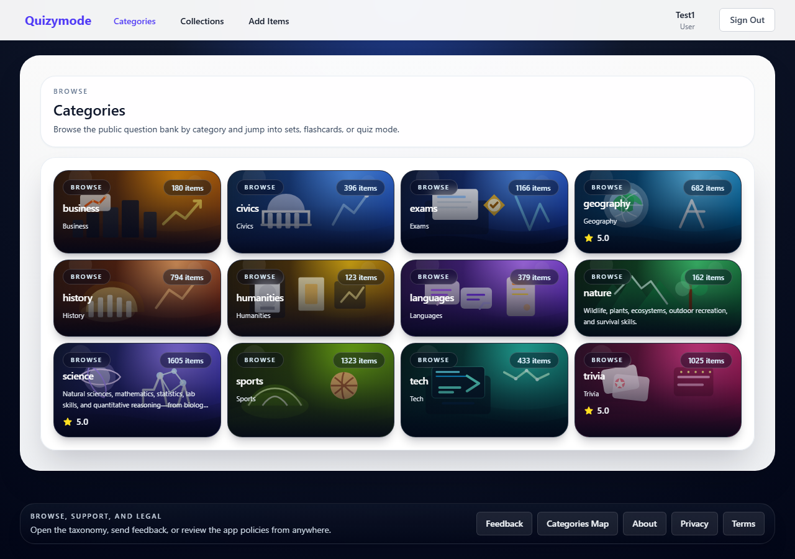
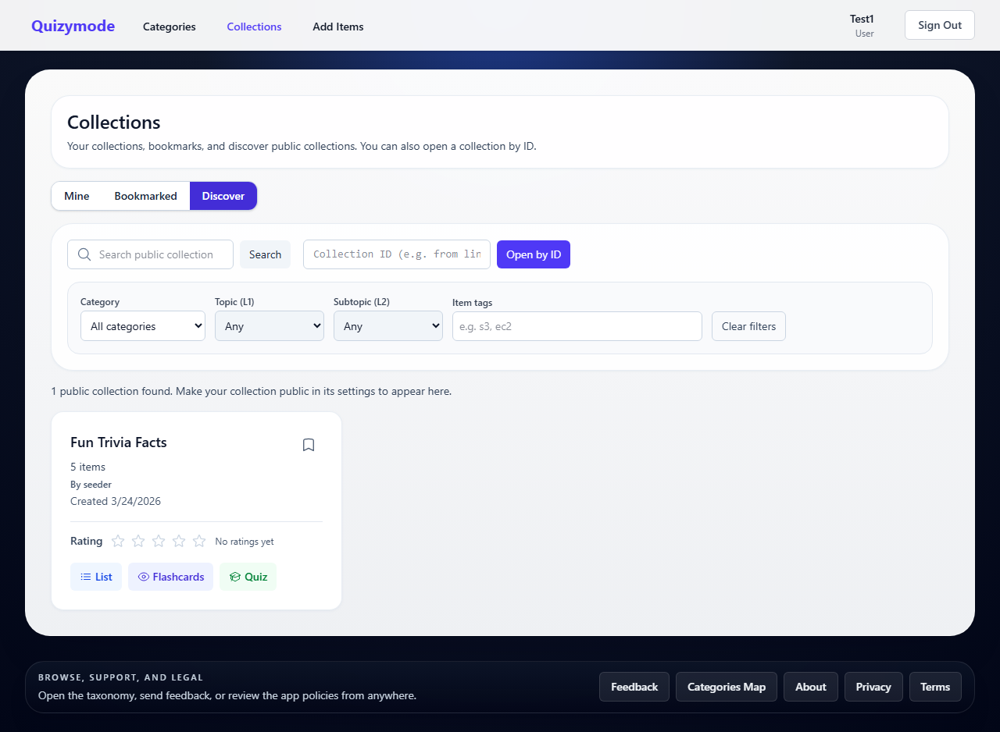

# Quizymode User Guide

This guide provides an overview of the main screens available to signed-in users.
_Screenshots are generated automatically — run `npx playwright test && node scripts/generate-user-guide.js` from the repo root to refresh them._

## Table of Contents

- [Home](#home)
- [Categories & Keywords](#categories-keywords)
- [Adding Items](#adding-items)
- [Study Guide Import](#study-guide-import)
- [Collections](#collections)
- [Other Pages](#other-pages)

## Home

### Home

The home page is the main entry point for Quizymode. It shows a hero section with a link to a public sample collection you can explore immediately, a grid of subject-area category cards with artwork and descriptions, and a carousel of six featured sets linking directly to specific study scopes. The footer provides access to Feedback, Categories Map, and About from anywhere in the app.

## Categories & Keywords

### Categories

The Categories page lists all public subject areas available in Quizymode. You can search categories by name and sort by name, number of items, or average rating. Clicking a category opens its Sets view, where you can drill down through topics and subtopics to find exactly the items you want to study.

### Category Detail

A category detail page (Sets view) shows the primary topics (rank-1 keywords) available for that subject area as clickable bucket cards. Each card displays the topic name, item count, and optional description. Clicking a bucket narrows the scope to that topic and reveals the next level of subtopics. A breadcrumb trail at the top lets you navigate back up the hierarchy at any point.

### Category Keyword Group

After selecting a primary topic you reach the subtopic level (rank-2 Sets view), showing the specific sections or units available under that topic. Selecting a subtopic opens the item list for that full navigation path (category → primary topic → subtopic). From there you can switch between List Items, Flashcards, and Quiz modes for the same scope, add individual items to your active collection, or filter by tags and search text.

## Adding Items

### Add Items

The Add Items hub is the central starting point for creating new quiz content. It provides a Topic and tags block where you choose category, primary topic (rank 1), subtopic (rank 2), and optional extra keywords — the same scope is forwarded to whichever creation method you pick. From here you can open the single-item create form, the AI-assisted Bulk Create flow, or the Study Guide import wizard. If you have an active collection, a banner reminds you that newly created items will be added to it automatically.

### Add New Item

The Create Item form lets you write a single quiz item from scratch. Fill in the question, one correct answer, up to three incorrect answer options, an optional explanation, and a source URL. Category, primary topic, and subtopic are required and must be chosen from the taxonomy. You can add extra keywords and, if you are a regular user, request an admin review to make the item public. Successfully created items are automatically added to your active collection.

### Bulk Create Items

The Bulk Create page (AI-assisted, no Study Guide) streamlines adding many items at once using an external AI assistant. Choose your category, primary topic, and subtopic; the app generates a structured prompt you copy into any AI tool (e.g. ChatGPT or Claude). Paste the AI response back and the app parses the JSON into a review list where you can accept or reject each item individually before anything is saved to the database.

## Study Guide Import

### Study Guide

The My Study Guide page is a personal text editor where you paste or write the study material you want to turn into quiz items — lecture notes, textbook excerpts, documentation, or any reference text. Your study guide is saved per user and used as the source content for the Study Guide import wizard, which generates targeted questions from it using AI.

### Study Guide Import

The Study Guide import wizard turns your saved study guide text into quiz items in a guided multi-step flow. Select the category, primary topic, subtopic, and optional extra keywords; the wizard splits your text into chunks and generates an AI prompt per chunk. Paste each chunk's response back and the wizard validates and enriches the items. At the end you review the combined results and finalize the import, which saves accepted items as private items under your chosen scope.

## Collections

### Collections Mine

The My Collections tab shows all collections you own. Each card displays the collection name, description, item count, and sharing status. You can set any collection as your active collection (used for the one-click add-to-collection control on item pages), edit name, description, or the "Shared with others" toggle, copy the shareable link, or delete the collection. Creating a new collection is available from this tab.

### Collections Discover

The Discover tab lets anyone browse and search public collections shared by other users. You can filter by text (collection name or description), subject category, primary topic, subtopic, and item tags. Signed-in users can bookmark collections for quick access and rate them with 1–5 stars. You can also open any collection directly by entering its ID.

### Collection Detail

A collection detail page shows a specific collection's name, description, owner, and the full list of items it contains. Items can be viewed in List Items, Flashcards, or Quiz mode using the same mode switcher as category pages. Owners can add or remove items, edit collection settings, or delete the collection. Non-owners with access (public collections) can study and rate the collection but cannot modify it.

## Other Pages

### About

The About page shows the current version and build identifier of the deployed frontend so you can confirm exactly which release you are running. It also provides basic product information about Quizymode.

### Feedback

The Feedback page provides three entry points: Report an issue, Ask for more items, and Provide feedback. Selecting any option opens a shared feedback dialog with the current page URL pre-filled and an optional email field (pre-filled from your account when signed in). The "Ask for more items" flow also includes an optional Additional keywords field to specify the topic you want covered.

